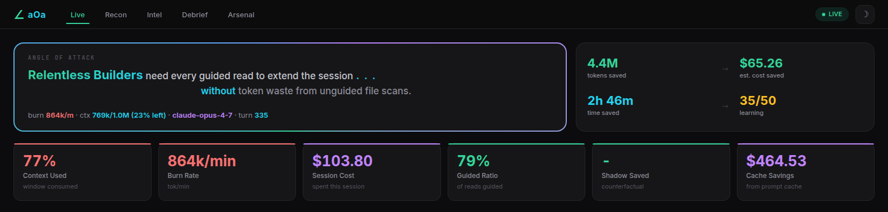
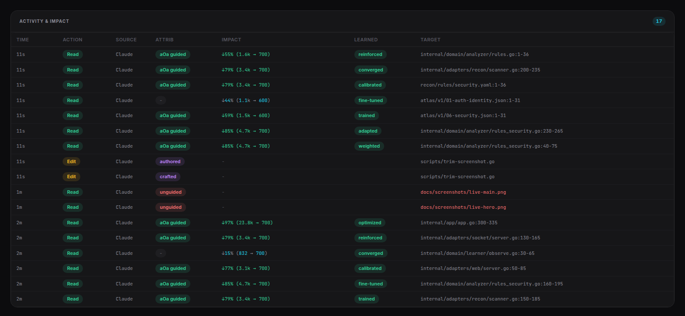
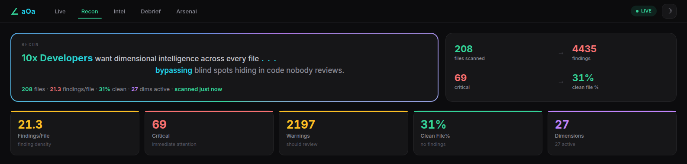
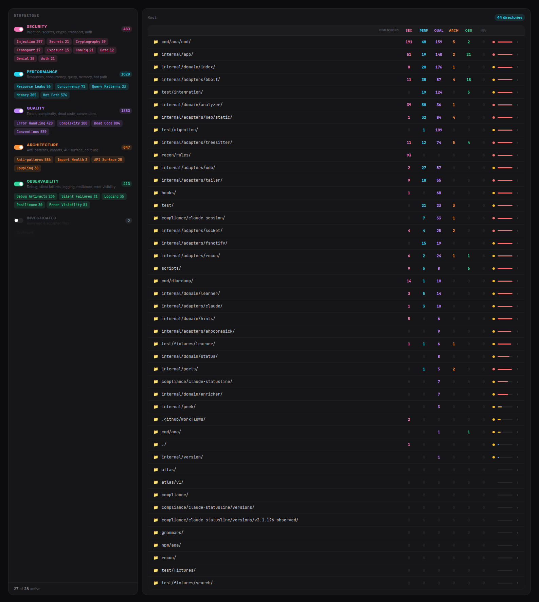
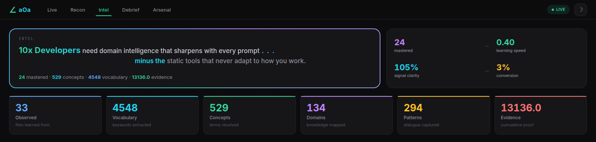
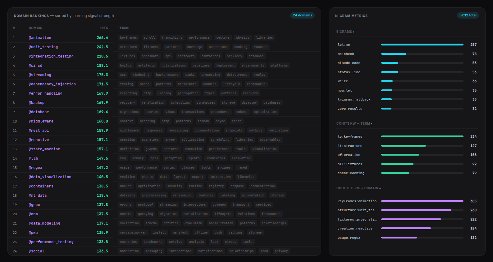
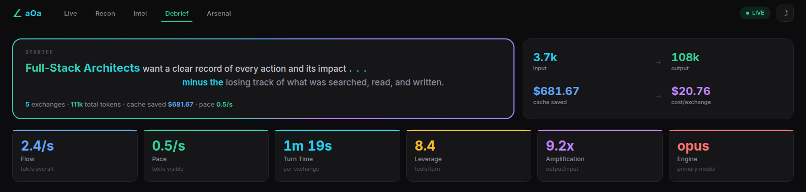
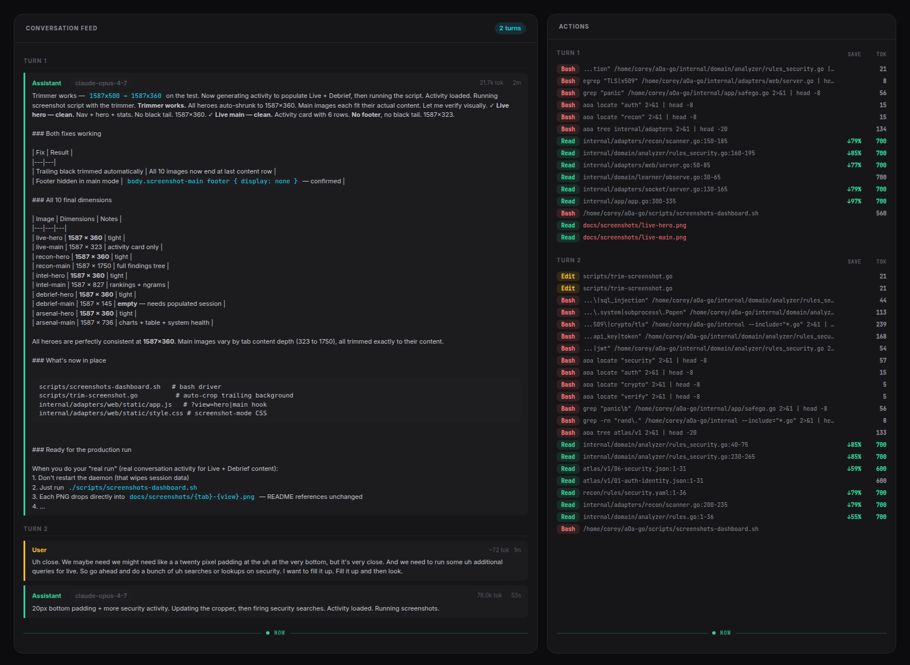
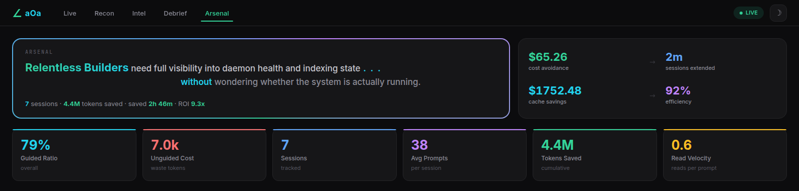
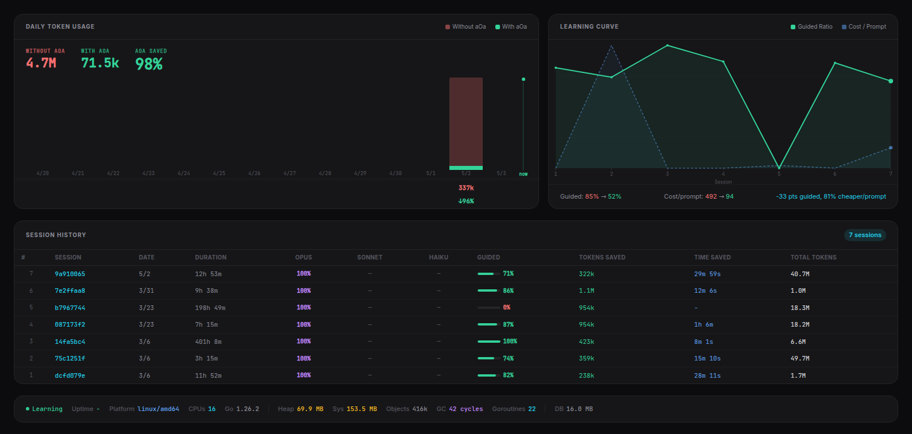

# aOa — Angle O(1)f Attack

> **Five angles. One attack. One binary.**
>
> Save your tokens. Save your time.

---

## Install

**Option A — Global install** (requires root/sudo, adds `aoa` to your PATH):
```bash
npm install -g @mvpscale/aoa
aoa init
```

**Option B — No root needed** (use `npx` to run):
```bash
npm install @mvpscale/aoa
npx aoa init

```

**Pro tip:** Run the entire download, install, and init process in one shot:
```bash
npx aoa init --update
```

That's it. aOa detects your languages, installs grammars, and starts learning. Have Claude Code use it and you're already saving tokens. aOa is project-scoped — everything lives in your project folder. Run `aoa init` in as many projects as you want.

---

## What You Get First: The Status Line

The moment aOa is running, you get a status line inside Claude Code:

<p align="center">
  
</p>

That's a real session — over 100 million tokens saved across roughly a week of work. The time range (62h-156h) is a range because we're honest: you can't precisely measure time saved. We calculate it based on measurable token savings alone — not on faster result ranking, not on fewer follow-up searches, not on any of the other ways aOa speeds things up. Those are real but not quantifiable, so we don't claim them. What you see is what we can prove.

Fully configurable. Everything you'll see in the dashboards below — tokens saved, burn rate, domains mastered, cost per exchange, context runway — can be surfaced right here in the status line. 25 segments across Live, Intel, Debrief, and Runway categories. Edit `.aoa/status-line.conf`, save, done.

**You could stop here.** aOa is already saving you tokens, already learning your codebase. You're done.

But you want to know what's *really* going on.

---

## The Problem No One Measures

There's no shortage of methodologies for AI-assisted development. BMAD. Spec-driven. Test-driven. Context management frameworks. Prompt chaining. Memory systems. They all aim to help you write better code faster — and many of them do.

But none of them tell you what they cost.

Are you spending 5x on tokens because your methodology front-loads context? 10x because your spec chain regenerates the same files every session? Is your context management strategy actually managing context, or is it just adding more of it? These are real questions with real dollar answers, and until now there was no way to measure it.

aOa gives you the measurement. Every token in, every token out, every search, every file read — tracked, scored, and displayed. Compare session A (your methodology) to session B (a different approach) and find out which one actually wins. Not in theory. In tokens. In dollars. In time.

---

## Behind the Veil

aOa's dashboard gives you real-time visibility into what's actually happening. Every metric tells a story. Every number is something you can verify.

Let's walk through it.

---

### Live

<p align="center">
  
</p>

What's happening right now, this session.

| Metric | The Story |
|--------|-----------|
| **Tokens Saved** | Every token saved is a token that didn't consume your context window — keeping your session alive longer. |
| **Est. Cost Saved** | Tokens converted to dollars at current API rates. Money that stayed in your pocket. |
| **Time Saved** | Wall-clock time you didn't spend waiting. Based on median token generation speed. |
| **Learning** | Progress toward the next autotune cycle. Every 50 prompts, aOa recalibrates its understanding of your project. |

<p align="center">
  
</p>

The live activity feed. Context usage, burn rate, session cost, guided ratio, shadow savings — all updating in real-time. This is where you watch your strategy play out and decide if it's actually working.

---

### Recon — Dimensional Analysis

Static analysis platforms charge tens of thousands per month — and they make you pay per language, per codebase, per scan, per seat. We built a single funnel into an 8MB binary. 500+ languages. No scan limits. No subscriptions. Run it on everything, all the time.

Recon uses tree-sitter to parse your code into an abstract syntax tree — a structural map of every function, class, and call in your codebase — then runs it through a proprietary 1-bit micro-embeddings model across five dimensions — Security, Performance, Quality, Observability, and Architecture. Each dimension asks up to 64 independent questions of every method in your codebase. When we flag something like injection, it's not a single pattern match — it's dozens of questions converging across every line of every method, looking for a digital signature. Micro-embeddings, Aho-Corasick text matching, AST structural analysis, and abstract roll-up scoring all run together at O(1) bit speed. 180+ rules. Five dimensions. Every file, every language, <1ms — this is the way.

Is it perfect? No — we're still human, and some detections may be inaccurate. But it's fast, it's comprehensive, and if something looks wrong you flag it for follow-up and keep moving. Find a pattern problem, send it straight to Claude or any CLI tool. That's the workflow.

This is v1. The code flow graph — a subway map of how calls propagate through your codebase — is on the roadmap. That doesn't exist yet in a local binary. It will.

<p align="center">
  
</p>

| Metric | The Story |
|--------|-----------|
| **Files Scanned** | How many source files the analysis covered. Broader coverage means a more trustworthy posture. |
| **Findings** | Total issues across all dimensions and severity levels. Each one is a concrete improvement opportunity. |
| **Critical** | High-severity findings that need attention now — security, reliability, correctness. Address these first. |
| **Clean File %** | Files with zero findings. The positive side of the story — higher means a healthier codebase. |

<p align="center">
  
</p>

The full dimensional breakdown. Languages, file distribution, grammar coverage, finding severity, pattern details. Your codebase health report — in seconds, not sprints.

> [!WARNING]
> **Top 1% of coders — want to know how this actually works?**

<details>
<summary><b>Open the hood — the micro-embeddings model</b></summary>

<br>

The entire model is six `uint64` values — 48 bytes. That's it.

```
type Bitmask [6]uint64    // 6 tiers × 64 bits = 384 dimensions
```

Each tier covers a domain: **Security**, **Performance**, **Quality**, **Observability**, **Architecture**, and a reserved slot. Each bit position is a specific yes/no question — "is there a hardcoded secret on this line?", "is this a defer inside a loop?", "does this domain layer import an adapter?" ~180 rules across 5 active tiers.

**Three detection layers run per file:**

1. **Text patterns** — Aho-Corasick automaton, single-pass O(n). Finds candidates like `exec.Command(`, `SELECT`, `password =`.
2. **Structural** — tree-sitter AST walk. 509 grammars collapse into 15 universal concepts (`call`, `assignment`, `for_loop`, `function`...). A rule like "SQL concatenation inside a query call" works unchanged across Go, Python, Java, Rust — all 509 languages.
3. **Regex confirmation** — per-line regex on candidates to cut false positives. Pattern like `AKIA[0-9A-Z]{16}` confirms an AWS key isn't just the word "key."

For composite rules, all layers must agree within ±3 lines. Text finds the candidate, structure confirms the context, regex validates the format.

**Per-method scoring:**

```
score = base + co_occurrence + clustering + breadth
```

- **Base**: each fired bit contributes by severity — critical (10), high (7), warning (3), info (1) — modulated by *density* (what fraction of the method's lines trigger this bit). A single `info` hit in a 500-line method scores ~0.01. That same pattern on 20% of lines is a real signal.
- **Co-occurrence** (+2.0): two bits firing on the *same line* — SQL concat + raw query call = compound finding, not two separate observations.
- **Clustering** (+1.0 per unique bit): findings within ±2 lines of each other form a cluster. Adjacent problems are related problems.
- **Breadth** (+1.0 per warning bit beyond 2): many distinct findings in one method = systematic debt.

**Gate: score ≥ 3 surfaces. Below 3 is noise.** One critical hit clears the gate instantly (score = 10). Scattered low-severity findings in large methods stay suppressed. Dense compound patterns in small methods surface.

All bit operations are hardware-accelerated (`math/bits.OnesCount64`). The entire file analysis pipeline runs in 10-30ms. No neural networks. No embeddings server. No API calls. Just bit math.


</details>

> [!TIP]
> Thanks for reading. It's all configured by YAML. Create your own rules, your own dimensions — enhance it, configure it, whatever you need. You're the 1%. Make it yours.

---

### Intel

<p align="center">
  
</p>

What aOa has learned about your codebase.

| Metric | The Story |
|--------|-----------|
| **Mastered** | Domains that earned core status through competitive displacement. These survived decay, outlasted rivals, and proved their relevance through repeated observation. |
| **Learning Speed** | Domains discovered per prompt. Rising means active exploration. Flattening means the system is converging on a stable model of your project. |
| **Signal Clarity** | What percentage of extracted terms resolve into real domains. Higher means vocabulary is crystallizing into structured knowledge, not noise. |
| **Conversion** | The intelligence funnel: raw keywords in, structured domains out. How efficiently observation becomes understanding. |

<p align="center">
  
</p>

The learning system in detail. Observed files, vocabulary size, concepts mapped, domain tiers, patterns extracted, evidence strength. This is the brain — watch it grow.

---

### Debrief

<p align="center">
  
</p>

The economics of your session.

| Metric | The Story |
|--------|-----------|
| **Input** | Everything you fed Claude — prompts, file contents, tool results. Each token counts against your context window and your bill. |
| **Output** | Everything Claude produced — code, explanations, tool calls, thinking. The work product of your session. |
| **Cache Saved** | Dollars you didn't spend because Anthropic's prompt cache served repeated context at a fraction of the price. |
| **Cost/Exchange** | Average dollars per back-and-forth. Your unit price — useful for budgeting and comparing strategies. |

<p align="center">
  
</p>

The full conversation breakdown. Flow rate, pace, turn time, leverage, amplification, engine. See exactly what Claude saw, what it cost, and where the savings came from. This is where you compare session A to session B and find out which approach actually wins.

---

### Arsenal

<p align="center">
  
</p>

Your lifetime scorecard. Four numbers that tell you whether aOa is earning its keep.

| Metric | The Story |
|--------|-----------|
| **Cost Avoidance** | Dollars not spent because aOa guided Claude to read targeted sections instead of entire files. The cumulative payoff of learning your codebase. |
| **Sessions Extended** | Minutes of runway gained. Sessions that lasted longer because aOa reduced context burn. |
| **Cache Savings** | Dollars saved by Anthropic's prompt cache — a second value stream working in parallel with guided reads. |
| **Efficiency** | One grade across guided ratio, cache performance, and savings rate. How well aOa is optimizing your workflow over time. |

<p align="center">
  
</p>

The full picture. Guided ratio across all sessions, unguided cost exposure, read velocity, session history. This is where you see the trend — are things getting better over time? They should be.

---

## What aOa Actually Does

When Claude Code runs `grep`, the results can be massive — a bad query against a large codebase can return 200K+ tokens of matches. We don't know exactly how many results Claude reads (that's proprietary), but we know it's burning anywhere from 10K to 60K tokens *per search* chasing grep tails. We identified **12 distinct token waste patterns** and eliminated them.

**aOa hijacks grep.** When Claude runs `grep`, aOa intercepts it and returns something fundamentally different: **semantically compressed results**. Not just `file:line:content` — the full method signature, the parent class, the line range of the entire symbol, the semantic domain, and tags. All in O(1) time, faster than grep itself.

**Standard grep returns this:**
```
services/auth/handler.py:15:    def login(self, user, password):
services/auth/handler.py:47:    def logout(self, session_id):
services/auth/middleware.py:62:    def get_user_from_token(self, token):
tests/test_auth.py:15:    def test_login_success(self):
tests/test_auth.py:37:    def test_login_invalid_password(self):
...
(hundreds more matches across the codebase)
```

Claude sees flat text. No structure. No ranking. It has to read files to figure out what matters.

**aOa returns semantic compression** — a launch pad of rapid context in every line:
```
services/auth/handler.py:AuthHandler.login(self, user, password)[15-45]:15  @authentication  #login #user
services/api/router.py:Router.handle_login(self, request)[37-55]:37  @api  #login #request
tests/test_auth.py:TestAuth.test_login_success(self)[15-35]:15  @testing  #login #test
```

Full signature (`AuthHandler.login`), parent class, exact line range (`[15-45]`), semantic domain (`@authentication`), and tags. The `@` domains and `#` tags aren't static — they're based on what you're doing in the code right now. As your intent changes, they change. They align to the meaning of the files and methods you're working on, driven by self-learning.

Claude reads this and *knows* — the auth handler's login method, lines 15-45, in the authentication domain. No file read needed. No follow-up searches.

**The system learns what you're working on.** As you refactor code — not greenfield, *existing* code — aOa tracks your intent and ranks results by the code you've been touching. The top 10 results are usually all you need. Claude can dive into specific methods instead of reading entire files. That's one of the 12 patterns we save.

We respect your `.gitignore`. We don't chase into build folders, `node_modules`, or other wasteful areas. Results are sorted by your intent, by recency, by how the system thinks you need them — all self-guided, all self-learning. Our results are typically fewer because we filter what doesn't matter, but every result hits harder.

We track the hit rate. When Claude receives results, reads a file, and goes straight into a response — that's an **aOa-guided event**. We know the result landed. We measure it. That signal feeds back into the learner, making the next search even better.

---

## The Five Angles

| Angle | What It Does |
|-------|--------------|
| **Search** | O(1) indexed lookup — same syntax as grep, orders of magnitude faster |
| **File** | Navigate structure without reading everything |
| **Behavioral** | Learns your work patterns, predicts next files |
| **Outline** | Semantic compression — searchable by meaning, not just keywords |
| **Intent** | Tracks session activity, shows savings in real-time |

All angles converge into **one confident answer**.

---

## Self-Learning

aOa gets smarter every session. No configuration. No training. Just use it.

It learns from *everything*:

- **Your prompts** — every question you ask Claude generates word pairs (bigrams) that reveal how you think about your project
- **Claude's thinking** — internal reasoning text gets mined for the same patterns
- **Claude's responses** — code explanations, answers, suggestions — all feed the signal chain
- **Every grep** — search patterns get tokenized into keywords, resolved into semantic terms, mapped to domains
- **Every file read** — which files Claude touches, how often, and whether aOa guided it there
- **Search results** — the top hits from every search feed back domains, terms, and content patterns
- **Tool calls** — reads, writes, edits, bash commands — all tracked, all scored

All of these signals converge into the learner:

1. **observe()** — Keywords, terms, domains, file hits, and co-occurrence pairs accumulate with every interaction
2. **autotune** — Every 50 prompts, a 21-step optimization runs: decay old signals, deduplicate, rank domains, promote/demote, prune noise
3. **competitive displacement** — Top 24 domains stay in core, others compete for relevance. Domains that stop appearing naturally fade out

No network calls. No AI calls for classification. State persists across sessions automatically.

---

## Commands

| Command | Description |
|---------|-------------|
| `aoa init` | Initialize aOa for your project |
| `aoa grep <pattern>` | O(1) indexed search (literal, OR, AND modes) |
| `aoa egrep <pattern>` | Regex search with full flag parity |
| `aoa find <glob>` | Glob-based file search |
| `aoa locate <name>` | Substring filename search |
| `aoa tree [dir]` | Directory tree display |
| `aoa domains` | Domain stats with tier/state/source |
| `aoa intent [recent]` | Intent tracking summary |
| `aoa bigrams` | Top usage bigrams |
| `aoa stats` | Full session statistics |
| `aoa config` | Project configuration display |
| `aoa health` | Daemon status check |
| `aoa wipe [--force]` | Clear project data |
| `aoa daemon start\|stop` | Manage background daemon |

---

## GNU Grep Parity

`aoa grep` and `aoa egrep` are drop-in replacements for GNU grep. When installed as shims, AI agents use them transparently.

**Three execution modes** — 100% aligned with GNU grep behavior:

| Mode | Invocation | Behavior |
|------|-----------|----------|
| **File grep** | `grep pattern file.py` | Searches named files, `file:line:content` output |
| **Stdin filter** | `echo text \| grep pattern` | Filters piped input line by line |
| **Index search** | `grep pattern` (no files, no pipe) | Falls back to aOa O(1) index |

**22 of 28 GNU grep flags implemented natively** — covering 100% of observed AI agent usage:

```
-i   Case insensitive          -n   Line numbers
-w   Word boundary             -H   Force filename prefix
-c   Count only                -h   Suppress filename
-q   Quiet (exit code only)    -l   Files with matches
-v   Invert match              -L   Files without matches
-m   Max count                 -o   Only matching part
-e   Multiple patterns         -r   Recursive directory search
-E   Extended regex            -F   Fixed strings (literal)
-A   After context             -B   Before context
-C   Context (both)            -a   AND mode (aOa extension)
--include / --exclude / --exclude-dir   File glob filters
--color=auto|always|never               TTY-aware color
```

Exit codes, output format, context separators, binary detection, multi-file prefixing, and ANSI handling all match GNU grep. Unrecognized flags fall back to system grep automatically.

---

## Language Support — 509 Languages

aOa ships with **509 tree-sitter grammars** compiled into the binary. 106 file extensions mapped. Languages are organized into four priority tiers — all validated, all production-ready.

**P1 — Core** (11 languages, compiled-in, always available):

> Bash, C, C++, Go, Java, JavaScript, JSON, Python, Rust, TSX, TypeScript

**P2 — Common** (11 languages):

> C#, CSS, Dockerfile, HTML, Kotlin, Markdown, PHP, Ruby, SQL, TOML, YAML

**P3 — Extended** (19 languages):

> Clojure, CMake, Dart, Elixir, Erlang, Gleam, GraphQL, Groovy, HCL, Lua, Make, Nix, R, Scala, Svelte, Swift, Vue, and more

**P4 — Specialist** (20 languages):

> Ada, CUDA, D, Elm, Fennel, Fortran, GLSL, Haskell, HLSL, Julia, Nim, Objective-C, OCaml, Odin, PureScript, Verilog, VHDL, Zig, and more

Every language gets full structural parsing — functions, classes, methods, symbols, all extractable. No per-language subscriptions. No scan limits. One binary.

<details>
<summary><b>All 509 languages — find yours</b></summary>

<br>

**Systems & Low-Level**

| Language | Language | Language | Language |
|----------|----------|----------|----------|
| C | C++ | Rust | Go |
| Zig | D | Odin | Nim |
| Ada | Fortran | Pascal | Carbon |
| Crystal | Hare | V | CUDA |
| Assembly | NASM | M68K | MIPS |
| LLVM | MLIR | Linkerscript | ISPC |

**Application & Enterprise**

| Language | Language | Language | Language |
|----------|----------|----------|----------|
| Java | Kotlin | Scala | C# |
| Swift | Objective-C | Dart | PHP |
| Ruby | Python | Perl | COBOL |
| ABAP | ABL | Apex | Groovy |
| Haxe | Magik | Eiffel | Simula |

**Web & Frontend**

| Language | Language | Language | Language |
|----------|----------|----------|----------|
| JavaScript | TypeScript | TSX | HTML |
| CSS | SCSS | Svelte | Vue |
| Astro | Angular | Pug | Slim |
| Haml | Blade | Twig | Mustache |
| Liquid | Jinja | HTMX | Glimmer |

**Functional & Academic**

| Language | Language | Language | Language |
|----------|----------|----------|----------|
| Haskell | OCaml | F# | Elm |
| PureScript | Clojure | Elixir | Erlang |
| Gleam | Racket | Scheme | Common Lisp |
| SML | Agda | Idris | Unison |
| Roc | Koka | Factor | Forth |

**Scripting & Shell**

| Language | Language | Language | Language |
|----------|----------|----------|----------|
| Bash | Fish | Elvish | Nu |
| PowerShell | AWK | Tcl | Lua |
| Luau | Julia | R | GDScript |
| Starlark | Fennel | Janet | Moonscript |

**Data, Config & Markup**

| Language | Language | Language | Language |
|----------|----------|----------|----------|
| JSON | JSONC | JSON5 | YAML |
| TOML | XML | CSV | TSV |
| INI | Dotenv | KDL | HOCON |
| HCL | Nix | CUE | Dhall |
| Markdown | LaTeX | Typst | AsciiDoc |
| GraphQL | Protobuf | Thrift | Cap'n Proto |

**DevOps & Infrastructure**

| Language | Language | Language | Language |
|----------|----------|----------|----------|
| Dockerfile | Earthfile | Nginx | Caddy |
| CMake | Make | Meson | Ninja |
| Bitbake | Just | Helm | Bicep |

**Database & Query**

| Language | Language | Language | Language |
|----------|----------|----------|----------|
| SQL | SQLite | BigQuery SQL | SOQL |
| SOSL | PromQL | SurrealQL | Kusto |
| Prisma | DBML | Rego | CQL |

**Hardware & EDA**

| Language | Language | Language | Language |
|----------|----------|----------|----------|
| Verilog | SystemVerilog | VHDL | GLSL |
| HLSL | WGSL | Bluespec | FIRRTL |
| PIO ASM | Devicetree | T32 | Tablegen |

**Blockchain & Smart Contracts**

| Language | Language | Language | Language |
|----------|----------|----------|----------|
| Solidity | Cairo | Move | Clarity |
| Tact | Leo | Circom | Aiken |

**And 200+ more** — DSLs, game engines (GDScript, GDShader), music (LilyPond), proof assistants (Agda, Lean), config formats, template languages, and everything in between. If tree-sitter parses it, aOa understands it.

</details>

---

## Your Data. Your Control.

- **Local-only** — single binary, no network calls, no containers
- **No data leaves** — your code stays on your machine
- **Open source** — Apache 2.0 licensed, fully auditable
- **Explainable** — `aoa intent recent` shows exactly what it learned

---

## Uninstall

```bash
aoa remove
```

Or just delete the `.aoa/` folder from your project. That's all there is. Nothing else on your system.

---

## Performance

The [original aOa](https://github.com/MVP-Scale/aOa) ran as a Python service in Docker. This is a clean-room Go rewrite:

| Metric | Python aOa | aOa | Improvement |
|--------|-----------|--------|-------------|
| Search latency | 8-15ms | <0.5ms | **16-30x faster** |
| Autotune | 250-600ms | ~2.5&micro;s | **100,000x faster** |
| Startup | 3-8s | <200ms | **15-40x faster** |
| Memory | ~390MB | <50MB | **8x reduction** |
| Install | Docker + docker-compose | Single binary | **Zero dependencies** |
| Infrastructure | Redis + Python services | Embedded bbolt | **Zero services** |

---

## From the Founder

aOa started because I watched Claude Code burn through tokens rediscovering code it already found. Every session, the same searches. The same files. The same wasted context.

The fix isn't more AI. It's a map. aOa builds that map — locally, silently, from the signals Claude already produces. No network calls. No cloud services. Just a binary that watches and learns.

This is open source because the best tools are shared ones. If aOa saves you tokens, saves you time, or teaches you something about how AI agents actually work — pay it forward. File an issue. Submit a fix. Tell someone.

Build something that matters.

— Corey, [MVP-Scale.com](https://mvp-scale.com)

---

## Acknowledgments

aOa builds on outstanding open-source work:

- **[tree-sitter](https://tree-sitter.github.io/tree-sitter/)** — incremental parsing framework powering 28-language structural analysis
- **[go-sitter-forest](https://github.com/alexaandru/go-sitter-forest)** — Go bindings for 509 tree-sitter grammars
- **[cobra](https://github.com/spf13/cobra)** — CLI framework
- **[bbolt](https://go.etcd.io/bbolt)** — embedded key-value store
- **[fsnotify](https://github.com/fsnotify/fsnotify)** — cross-platform file system notifications
- **[purego](https://github.com/ebitengine/purego)** — calling C from Go without CGO
- **[testify](https://github.com/stretchr/testify)** — test assertions
- **[aho-corasick](https://github.com/petar-dambovaliev/aho-corasick)** — multi-pattern string matching

---

## License

Apache License 2.0. See [LICENSE](LICENSE) for the full text.

Copyright 2025-2026 [MVP-Scale.com](https://mvp-scale.com)
