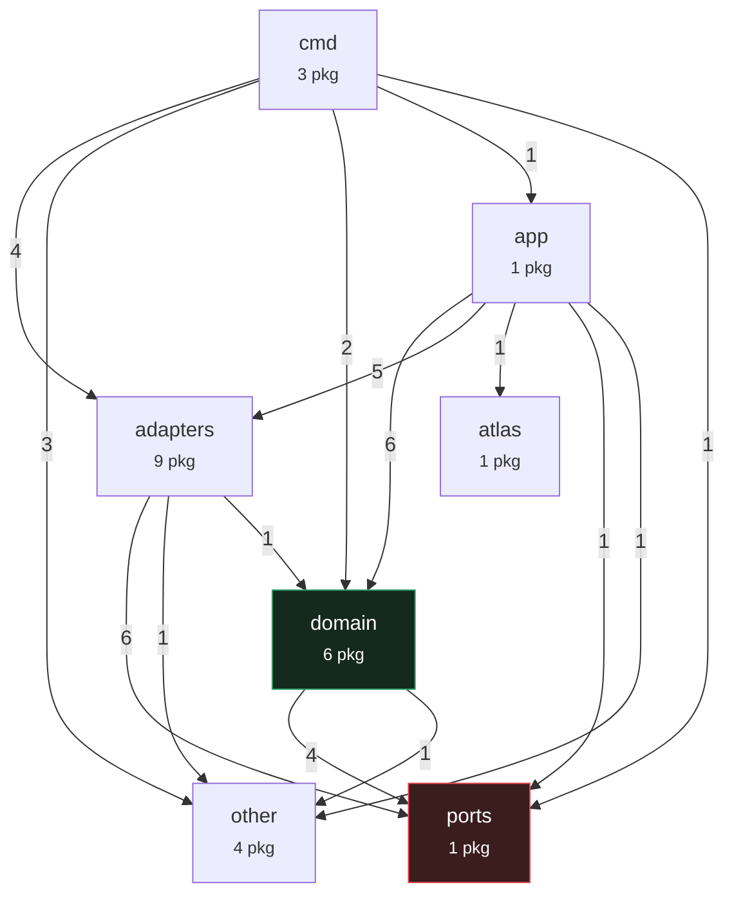
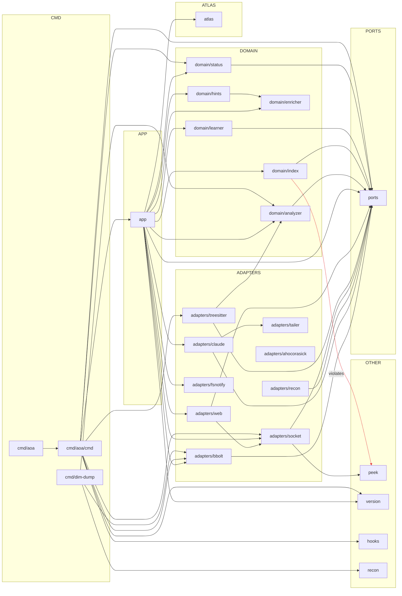

# Architecture — aoa

*Generated from live source by aOa on 2026-06-10T05:34:27Z. 25 internal packages, 42 dependency edges, 542 third-party modules. Source: AST package index + `go list`. This document regenerates from code; it does not drift.*

## 1. System Overview

`aoa` is a Go application organised as a hexagonal (ports & adapters) architecture across 7 layers: cmd, app, adapters, domain, ports, atlas, other. The contracts hub is **`ports`** (fan-in 12 — most depended-on), and the composition root is **`app`** (fan-out 14 — wires everything together).

## 2. Building Block View — Layer Dependencies (C4 Container level)

Edge labels = number of package dependencies crossing between layers.

## 3. Component View — Package Dependencies (C4 Component level)

## 4. Layering & Conformance Assessment

Intended dependency direction (hexagonal): `cmd → app → adapters → domain → ports`. A dependency pointing *up* this order is a layering violation.

**Findings (1 violation):**
- `domain/index` → `peek` (domain → other, points up the layers)

## 5. Dependency Inventory

| Package | Layer | Fan-in | Fan-out |
|---|---|---|---|
| `ports` | ports | 12 | 0 |
| `adapters/bbolt` | adapters | 3 | 1 |
| `adapters/socket` | adapters | 3 | 2 |
| `domain/analyzer` | domain | 3 | 1 |
| `domain/enricher` | domain | 2 | 0 |
| `domain/status` | domain | 2 | 1 |
| `peek` | other | 2 | 0 |
| `version` | other | 2 | 0 |
| `atlas` | atlas | 1 | 0 |
| `cmd/aoa/cmd` | cmd | 1 | 8 |
| `hooks` | other | 1 | 0 |
| `adapters/claude` | adapters | 1 | 2 |
| `adapters/fsnotify` | adapters | 1 | 0 |
| `adapters/tailer` | adapters | 1 | 0 |
| `adapters/treesitter` | adapters | 1 | 2 |
| `adapters/web` | adapters | 1 | 2 |
| `app` | app | 1 | 14 |
| `domain/hints` | domain | 1 | 1 |
| `domain/index` | domain | 1 | 2 |
| `domain/learner` | domain | 1 | 1 |
| `recon` | other | 1 | 0 |
| `cmd/aoa` | cmd | 0 | 1 |
| `cmd/dim-dump` | cmd | 0 | 3 |
| `adapters/ahocorasick` | adapters | 0 | 0 |
| `adapters/recon` | adapters | 0 | 1 |

## 6. Provenance

Every element above is derived from the codebase: package nodes and edges from `go list`, layer assignment from path, third-party inventory (see `sbom.cdx.json`, CycloneDX 1.6) from the module graph. No hand-authoring; regenerate on commit.
